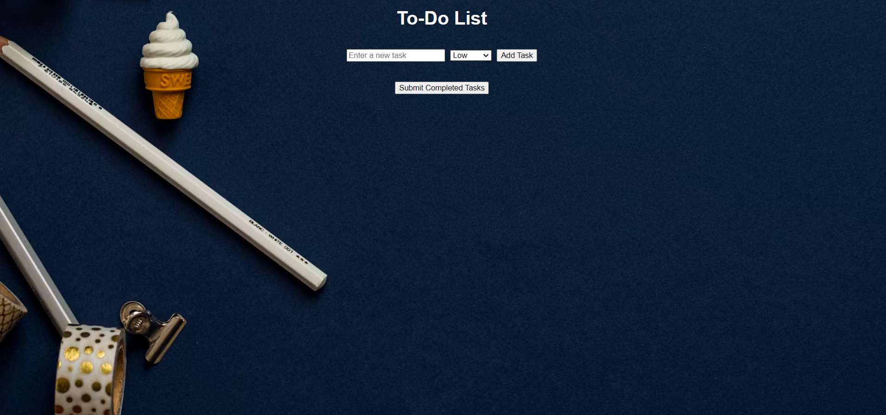
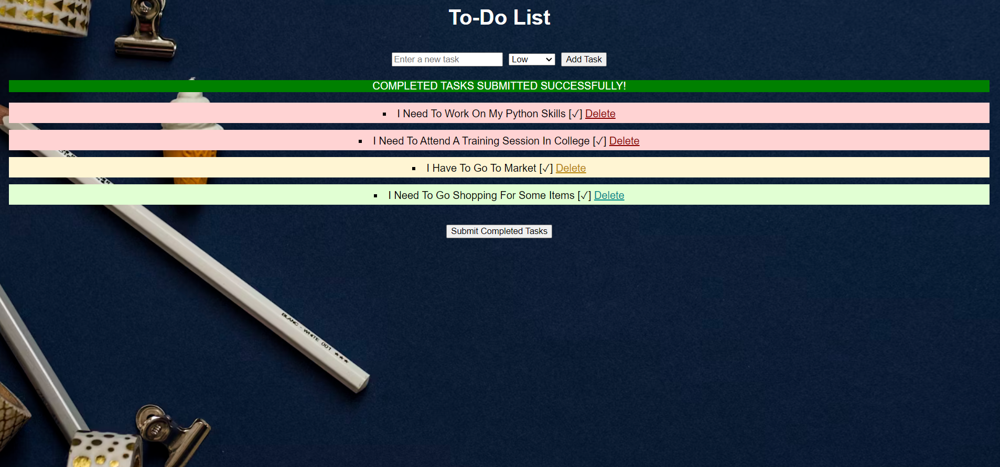

# To-Do List Application

A simple to-do list application built with Flask. This application allows users to add tasks, set priorities, mark tasks as completed, and submit completed tasks to a text file.

## Features

- Add tasks with priority levels (low, medium, high).
- Mark tasks as completed.
- Delete tasks.
- Submit completed tasks to a text file (`submitted_tasks.txt`).

## Requirements

- Python 3.7 or later
- Flask==2.3.3

# Screenshots


### Web-interface of to-do-list-application



### After tasks are added and marked as complete, clicking 'Submit' will display them as follows


## Installation

1. **Clone the Repository:**
   ```bash
   git clone <repository-url>
   cd <repository-name>

## Running the Application
-- Start the Flask Application:
1. python app.py
2. Open Your Web Browser:
Navigate to http://127.0.0.1:5000/

